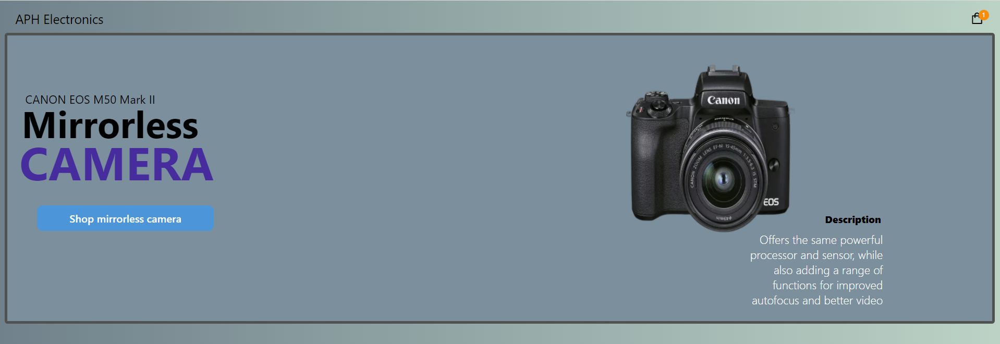
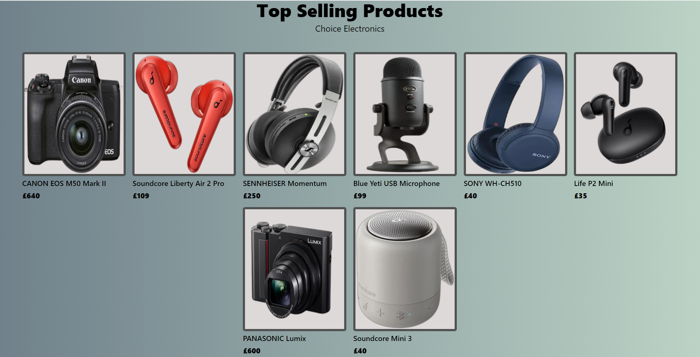
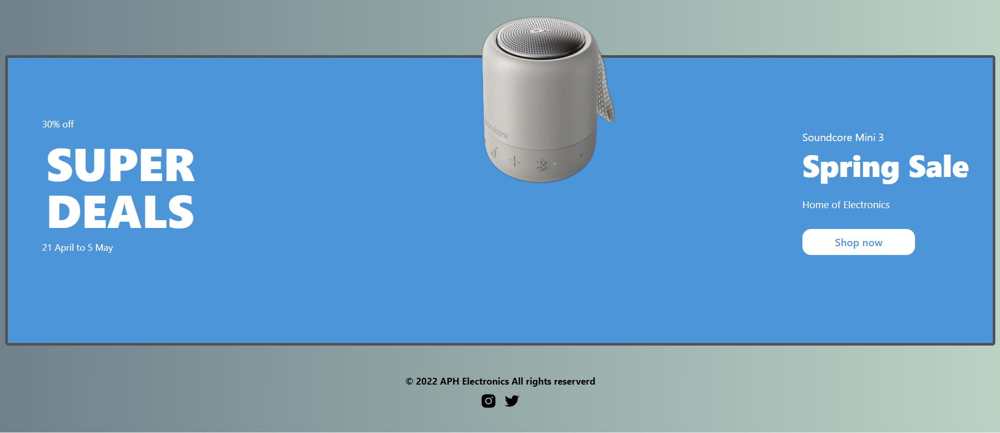
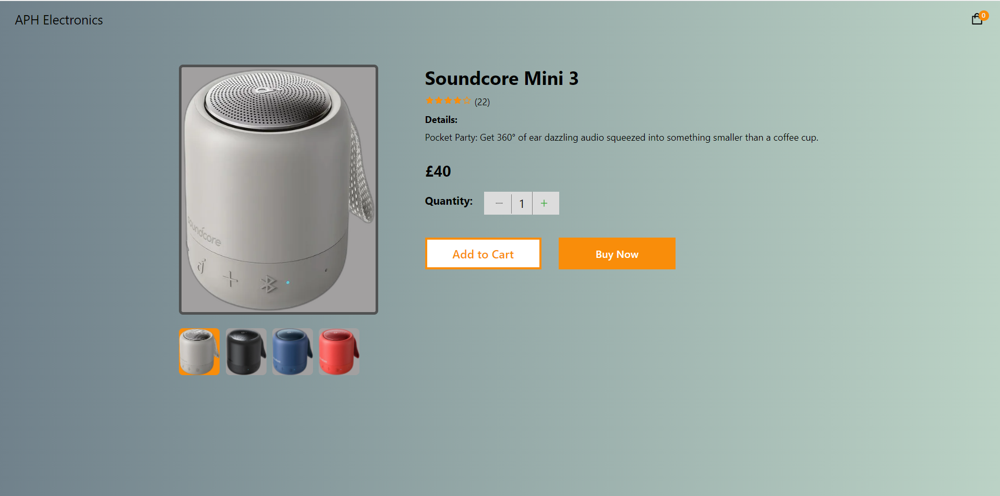
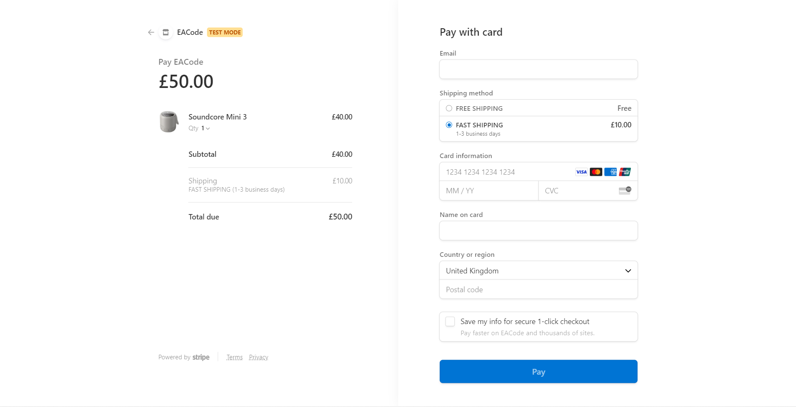
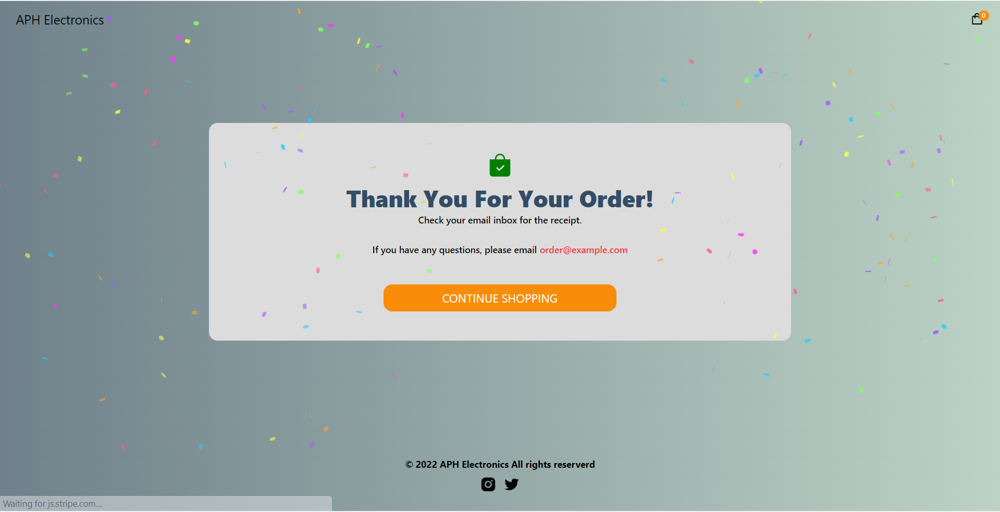

# Jasmit's Electronics

<h2>Full Stack E-Commerce Application with Next.js, Sanity and Stripe</h2>

 
APH Electronics is a website with animations, user's with administrator rights can add and edit products on the move using sanity a type of cms (content management system). APH Electronics has a cart function and integration with stripe which allows you to make test or <b>real</b> payments. 
 
<b>Software used:</b> 
 
Front end: React.js, back end: Next.js(as a backend endpoint), CMS: Sanity(file storage and database) and payment system: Stripe.
 
 
<li>React: hooks and refs.
<li>React: State Managament of the whole application using React Context API.
<li>Next.js: File-based routing, Data fetching that allows server-side rendering and Next.js is used as a backend endpoint. 
<li>Sanity enables you or clients to edit the store's homepage as well as the details of all the products in the store quickly and on the move. 
<li>Stripe is use to manage payments, products, shipping rates and the whole checkout operation.  
 
 
 
 
 
 
 
 

  
  
